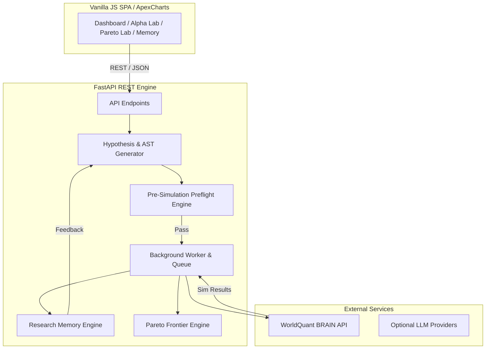

# VERDE System Architecture

## Modular Components
1. **API Layer (`backend/app/api/`)**: REST controllers for candidates, simulations, analytics, research families, AI, and system logs.
2. **BRAIN Client (`backend/app/brain/`)**: Strict payload validation, resilient polling, authentication manager, and response parser.
3. **Generation Engine (`backend/app/generation/`)**: AST representation, expression compiler, 17+ research families, field registry, operator registry, and safe transformations.
4. **Preflight Engine (`backend/app/generation/preflight.py`)**: Multi-stage filtering preventing constant signals and temporal mismatches.
5. **Research & Pareto Layer (`backend/app/research/`)**: Weighted alpha research scores, non-dominated sorting, candidate tiering, and persistent memory.
